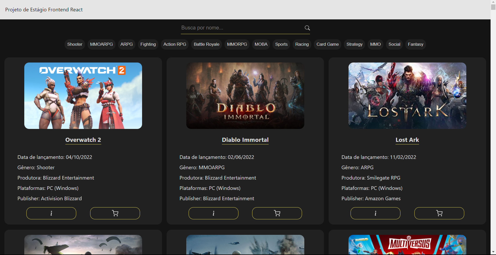
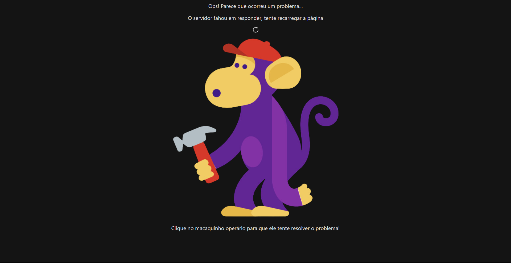
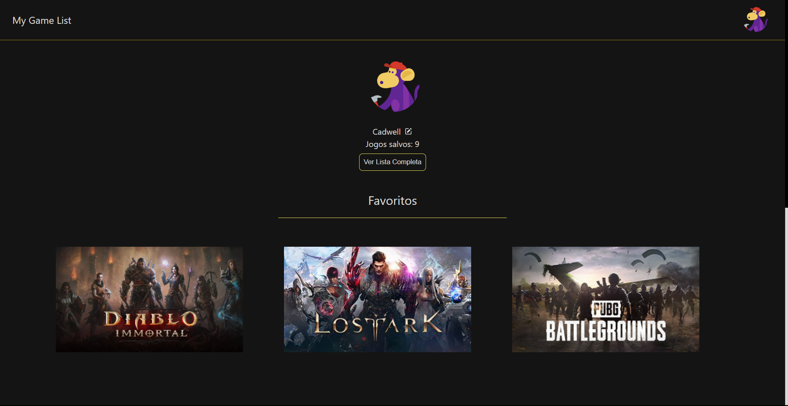

<h1 align="center">Projeto Game List 🎮</h1>  

<h3 align="center"> Aplicação React para listagem de jogos buscados em uma API </h3>
 

A aplicação permite que o usuário acesse um banco de dados através de uma API fornecida. Durante a busca por esses dados, uma página de carregamento é mostrada para o usuário, mas assim que os dados chegam (ou exista algum erro) essa página de carregamento some e dá espaço a uma nova página. 
Caso a API retorne algum erro, a página de erro será mostrada e um de nossos incríveis ajudantes --o macaquinho consertador-- estará lá para tentar consertar o problema!

Caso dê tudo certo e os dados sejam acessados, a página principal da aplicação irá aparecer e entregar os dados de maneira organizada. Além disso, o usuário pode filtrar os jogos pelo nome ou pelo gênero do jogo.
A aplicação possui responsividade, possuindo uma apresentação diferente no destkop/tablet/mobile, de forma que a navegação seja adequada independentemente do dispositivo de acesso.

Agora temos a função de criar conta e favoritar os jogos preferidos do usuário. Além disso, também é possível avaliar qualquer jogo!

 
<h2 align="center"> 
	✅... Projeto Finalizado ...✅
</h2>
 
<h3 align='center'> Objetivos do projeto (FASE 1)</h3>

- [x] Obter a lista de jogos em /data
- [x] Apresentar um loader enquanto os dados são obtidos
- [x] Apresentar os jogos em três colunas (no computador)
- [x] Em cada card apresentar o título e imagem pelo ao menos
- [x] Lidar com a responsividade, para que fique bem apresentado no computador, tablets ou celular
- [x] Quando a API retornar o status code 500, 502, 503, 504, 507, 508 ou 509 apresentar ao usuário O servidor fahou em responder, tente recarregar a página
- [x] Caso a API retorne outros erros, apresentar O servidor não conseguirá responder por agora, tente voltar novamente mais tarde
- [x] Ao realizar uma chamada, não esperar mais que 5 segundos pelo retorno. Se os dados demorarem mais de 5 segundos para retornar apresentar O servidor demorou para responder, tente mais tarde
- [x] Sempre que apresentar uma mensagem para o usuário, ou tiver os dados em mãos para apresentar, ocultar o loader
- [x] Incluir um campo de busca, que permite localizar jogos pelo título, com busca case insensitive
- [x] Uma vez que tenha os dados em mãos, veja quais genre foram retornados e permita ao usuário selecionar um deles, e então filtre para exibir apenas jogos do gênero selecionado

<h3  align='center'>Objetivos do projeto (FASE 2)</h3>
  
- [x] Utilizar Firebase para realizar autenticação usando email/senha
- [x] Ter um  para o usuário favoritar o jogo diretamente na lista, ficando vermelho quando marcado
- [x] Salvar no firebase os jogos favoritos do usuário, no realtime ou firestore
- [x] Ter um botão “Favoritos” que apresenta apenas jogos favoritados, permitindo ainda buscar e filtrar estes jogos. Pode ser na própria lista já apresentada ou em uma separada se preferir.
- [x] Ao lado do coração, ter ★★★★ para o usuário avaliar o jogo, podendo marcar de uma em uma. Ou seja, ele pode escolher 1, 2, 3 ou as 4.
- [x] Ter uma forma de ordenar por avaliação, vendo os melhores (ou piores) primeiro, clicando novamente para inverter a ordem. 
- [x] Ao carregar a interface, deixar o  vermelho para os itens favoritos e as  amarelas nos itens avaliados
- [x] Ao acessar sem estar autenticado, os ícones  e  deverão estar visíveis, mas ao clicar irá solicitar a autenticação
- [x] Ao obter os jogos da API e os dados do firebase, apresentar. Manter o loading para os jogos. Não precisa de loading enquanto espera o firebase, até porque o firebase devolverá os dados mais rapidamente e pode ser complicado “esperar o firebase” se estiver “escutando o firebase”
- [x] A autenticação deve acontecer na rota /auth/ do frontend, usando o provedor “E-mail/senha” do firebase, onde o usuário poderá criar uma conta ou acessar a conta já existente (se mantendo apenas nesta rota)
- [x] Escolher um item para aplicar uma animação com CSS, pode ser ao favoritar, ou avaliar, ou quando os itens surgirem
- [x] Publicar seu projeto online para testarmos (na mesma url de antes)

## Evolução

### Prints do projeto (FASE 1)

### Prints do projeto (FASE 2)

### Link para acesso

O projeto já está disponível para ser acessado <a href="https://game-list-challenge.vercel.app">clicando aqui!</a> (clique com o botão do meio do mouse ou com o botao direito e selecione "Abrir em uma nova guia" para visitar o site)

### 🛠 Tecnologias

As seguintes ferramentas foram usadas na construção do projeto:

- [React](https://pt-br.reactjs.org/)
- [Vite](https://vitejs.dev/)
- [TypeScript](https://www.typescriptlang.org/)
- [StyledComponents](https://styled-components.com/)
- [React-icons](https://react-icons.github.io/react-icons/)
- [dayjs](https://day.js.org/)
- [React-Spinners](https://www.davidhu.io/react-spinners/)
- [Firebase](https://firebase.google.com)
