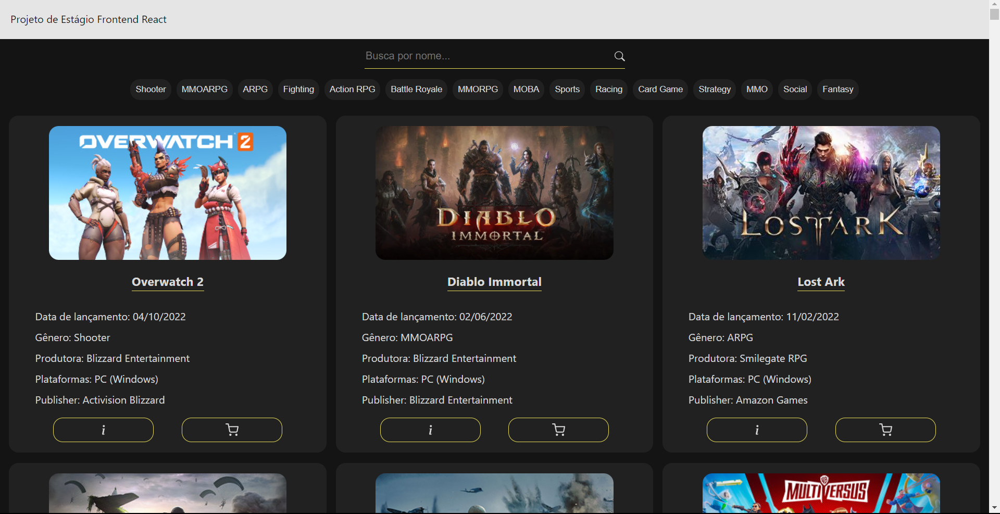
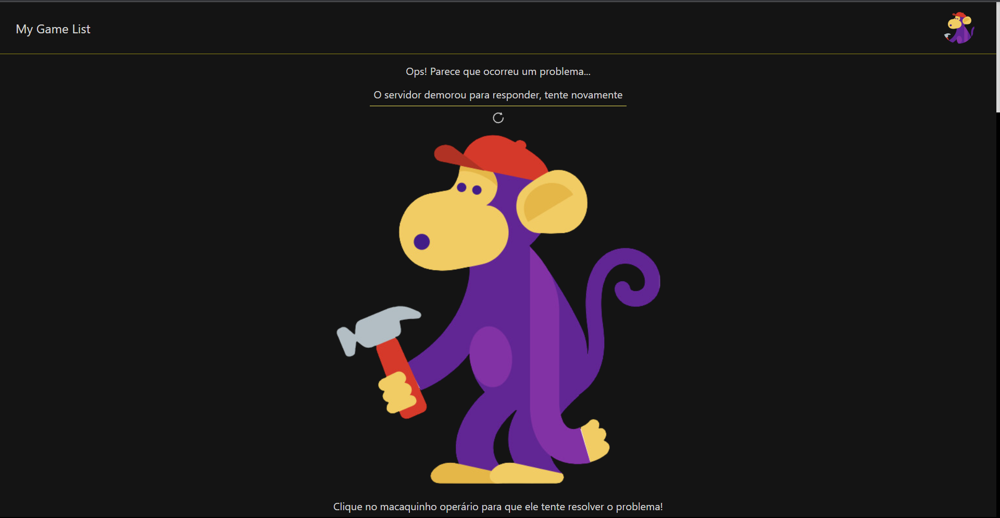

<h1 align="center">Projeto Game List 🎮</h1>  

<h3 align="center"> Aplicação React para listagem de jogos buscados em uma API </h3>

A aplicação permite que o usuário acesse um banco de dados através de uma API fornecida. Durante a busca por esses dados, uma página de carregamento é mostrada para o usuário, mas assim que os dados chegam (ou exista algum erro) essa página de carregamento some e dá espaço a uma nova página. 
Caso a API retorne algum erro, a página de erro será mostrada e um de nossos incríveis ajudantes --o macaquinho consertador-- estará lá para tentar consertar o problema!

Caso dê tudo certo e os dados sejam acessados, a página principal da aplicação irá aparecer e entregar os dados de maneira organizada. Além disso, o usuário pode filtrar os jogos pelo nome ou pelo gênero do jogo.
A aplicação possui responsividade, possuindo uma apresentação diferente no destkop/tablet/mobile, de forma que a navegação seja adequada independentemente do dispositivo de acesso.

<h4 align="center"> 
	✅... Projeto Finalizado ...✅
</h4>

### Objetivos do projeto
  
- [x] Obter a lista de jogos em /data
- [x] Apresentar um loader enquanto os dados são obtidos
- [x] Apresentar os jogos em três colunas (no computador)
- [x] Em cada card apresentar o título e imagem pelo ao menos
- [x] Lidar com a responsividade, para que fique bem apresentado no computador, tablets ou celular
- [x] Quando a API retornar o status code 500, 502, 503, 504, 507, 508 ou 509 apresentar ao usuário O servidor fahou em responder, tente recarregar a página
- [x] Caso a API retorne outros erros, apresentar O servidor não conseguirá responder por agora, tente voltar novamente mais tarde
- [x] Ao realizar uma chamada, não esperar mais que 5 segundos pelo retorno. Se os dados demorarem mais de 5 segundos para retornar apresentar O servidor demorou para responder, tente mais tarde
- [x] Sempre que apresentar uma mensagem para o usuário, ou tiver os dados em mãos para apresentar, ocultar o loader
- [x] Incluir um campo de busca, que permite localizar jogos pelo título, com busca case insensitive
- [x] Uma vez que tenha os dados em mãos, veja quais genre foram retornados e permita ao usuário selecionar um deles, e então filtre para exibir apenas jogos do gênero selecionado

### Prints do projeto

### Link para acesso

O projeto já está disponível para ser acessado <a href="https://game-list-challange.vercel.app">clicando aqui!</a> (clique com o botão do meio do mouse ou com o botao direito e selecione "Abrir em uma nova guia" para visitar o site)

### 🛠 Tecnologias

As seguintes ferramentas foram usadas na construção do projeto:

- [React](https://pt-br.reactjs.org/)
- [Vite](https://vitejs.dev/)
- [TypeScript](https://www.typescriptlang.org/)
- [StyledComponents](https://styled-components.com/)
- [React-icons](https://react-icons.github.io/react-icons/)
- [dayjs](https://day.js.org/)
